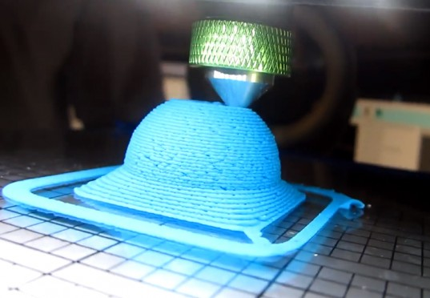
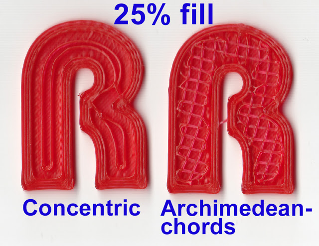

# SudoRoom 3D Printing

3D Printing models, projects and more from Oakland's SudoRoom

https://sudoroom.org/wiki/3DPrinting (the instructions on the wiki are currently out of date)

# How to print!

We have a Type A Machines printer and a Linux desktop running KDE that is attached to it. Anyone can use these to print!

###Extrusion 3D Printing

This printer extrudes 0.2-0.5mm of melted plastic at 185c onto a print bed while being controlled by a 3-axis cartesian grid robot.  The robot is controlled by the computer to extrude cross section after cross section, until it has built a full three-dimensional shape.

####Printability:  Grok the tech to use it well.

Since each layer is adhered to the layer below it, layers can only be built away from their bases at around a 45 degree angle at most, even then you'll have the occasional noodle-sag.  For this reason, it's worth considering what shapes are capable of being printed.

There are two tricks that are commonly used to print less-printable shapes, and those are support and bridging.

#####Slicing The Shape

When generating the instructions for the machine's print path ("Slicing" the shape), there are many options to adjust the machine's behavior, from how fast it prints (150mm is safe), how many shells to print the walls of a hollow shape, to adding printed patterns to support your object.

Support material is a uniform pattern printed underneath areas that exceed the 45 degree rule, or any degree rule you specify.  The slicing software provides a variety of support patterns, as well as fill patterns to save plastic and print time (the resulting strength is actually very comparable).

#####Bridging

The thread of molten plastic can be bridged across a gap, given that it's a straight path and it touches on both sides.  This requires a harmony of print speed, molten plastic temperature, and speed of the fan cooling the nozzle.  Hopefully if someone does some calibration tests for bridging, they can post some recommended speeds and temperatures for our printer.  Ideally some slicing presets to download.

### Turn on the printer

The power switch is on the back.

Since the e.g. if right-side up pyramids print very well, but upside-down pyramids don't print very well because the 3D printer can't very easily print things floationg in air with no supports.

### Get a 3D model

Get your 3D model into an `.stl` format.  [Meshlab](http://meshlab.sourceforge.net/) can convert just about anything into an STL.  It can help clean up your mesh, too!

####3D Model Sources####
[Thingiverse](http://www.thingiverse.com/).  Makerbot's "Youtube of 3d models" [requires content creators sign away ownership rights](http://www.thingiverse.com/thing:30808) to thingiverse.
[Bild3r](http://www.bld3r.com/).  Another all-free models repository.  Requires all ownership rights to be free to all.
[Cubehero](https://cubehero.com/) A new-comer to the scene, doesn't yet feature search.

### Slice your model

Open up the program called KISS Slicer and load your STL file into it. This program takes the model and 'slices' it up into a path for the printer head to take. It saves a file in the `.gcode` format.

### Print your gcode

Open up the program called Pronterface, connect to the printer and then load your `.gcode` file.

Some things to be aware of:

- You can pause the print from Pronterface and then use the Z control adjust the height of the print head from the bed. This is the most important thing to do! If the print head is smashing down too hard on the print bed you could damage the print head, the print bed, or simply jam the plastic in from extruding the first layer well.  If the nozzle is too high above the surface to start, the first layer won't stick to the bed, and you won't have a foundation for your shape, and plastic will noodle out into a plate of spaghetti vaguely resembling your 3d model.

- Keep an eye on the temperature. If something gets clogged or stuck the print head could overheat and the printer could get damanged, but if you keep an eye on it you can stop the print from Pronterface before the head has time to overheat.

- Make sure the plastic spools don't get jammed and pop out of the print head. Keep the pipes a flowin!

- If the plastic isn't extruding, the extruder (the motor that pulls the plastic into the hot-end) may not be tight enough to grip the plastic.  You can tighten the screw to tighten its grip, but if it's been tightened too much, it can damage the thread so much that it won't pull through anymore.  Then you have to heat up the hot end just to pull the plastic out, just to cut it a clean tip just to feed it back through.

- Don't let the spool jam, extruders are pretty strong.  I once saw a printer climb a wall up to its jammed spool.  It was on [reddit](reddit.com/r/3dprinting), I can't find it right now.

Have fun!
